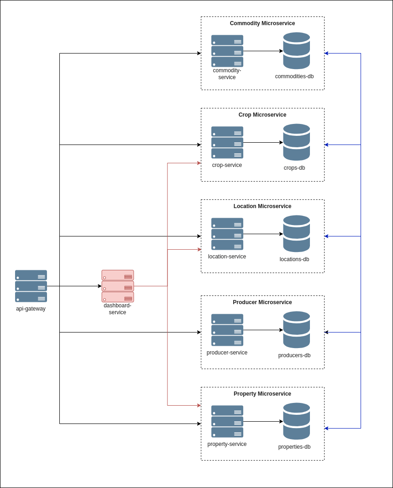

# Brain Agriculture - Teste Técnico v2

Esta aplicação foi desenvolvida seguindo a arquitetura de microserviços, com foco em alta escalabilidade e modularidade.

## Diagrama dos Serviços



A aplicação conta com um serviço exposto ao cliente chamado `api-gateway`. Esse serviço é responsável por receber todas as requisições e direcioná-las, via TCP, para os microserviços registrados.

Os demais serviços, exceto o `dashboard-service`, possuem bancos de dados PostgreSQL dedicados. A comunicação entre os microserviços é realizada exclusivamente via TCP, impedindo o acesso externo direto a esses serviços.

O `dashboard-service` recupera os dados necessários de outros serviços para compor os gráficos e relatórios exibidos na interface.

## Fluxo de Cadastro


O sistema foi projetado para que cada cadastro tenha sua própria autonomia. No entanto, alguns cadastros possuem dependências entre si. Por exemplo, o cadastro de propriedade depende dos cadastros de localização e produtor.

## Instalação

### 1. Requisitos
- Docker e Docker Compose instalados.
- Repositório clonado localmente.

### 2. Execução da Aplicação

A aplicação pode ser executada de duas formas:

#### 2.1 Executando toda a aplicação (APIs e bancos de dados) via Docker Compose
Para iniciar os containers:
```sh
docker-compose up -d --build
```
Para parar os containers:
```sh
docker-compose down --remove-orphans
```

#### 2.2 Executando as APIs localmente e os bancos de dados via Docker Compose
Inicie os bancos de dados:
```sh
docker-compose -f docker-compose-db.yaml up -d
```
Em seguida, inicie cada microserviço manualmente:
```sh
cd ./api-gateway  # Exemplo para o api-gateway
npm run start:dev
```
Para parar os bancos de dados:
```sh
docker-compose -f docker-compose-db.yaml down --remove-orphans
```

> Todos os arquivos de ambiente (`.env`) estão disponíveis com as variáveis devidamente atribuídas.

## APIs
Para testar os endpoints da aplicação, importe o seguinte arquivo JSON no Postman ou Insomnia:

[APIs.json](README_FILES/brain-ag.postman_collection.json)

## Testes e Monitoramento

Por limitação de tempo, foram realizados apenas testes básicos e monitoramentos no serviço `property-service`. Contudo, enfatizo que, em um ambiente real, é fundamental implementar testes automatizados abrangentes, monitoramento detalhado e logging eficiente em todos os serviços para garantir a estabilidade e confiabilidade do sistema.

