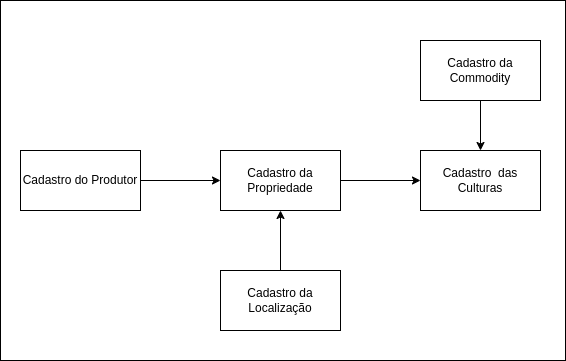

# Brain Agriculture - Teste Técnico v2

Essa aplicação foi desenvolvida utilizando a arquitetura de microserviços pensando em auta escalabilidade 

## Diagrama dos Serviços


Essa aplicação possui o serviço exposto ao cliente chamada api-gateway. Esse serviço é responsável por receber todas as chamadas e direcionar via TCP para cada microserviço registrado

Os outros serviços, exceto o dashboard-service, possuem bancos de dados Postgres dedicados. Cada serviço consegue comunicar com outro via TCP somente (não permitindo que o cliente externo os acessem)

O serviço de dashboard recupera os dados necessários para montar seus gráficos a partir dos dados recebidos dos outros serviços

## Fluxo de cadastro 



Esse sistema foi implementado para que cadastro tenha sua autonomia. Alguns cadastro possuem dependência com outros (ex. o cadastro de propriedade possui dependência do cadastro de localização e do cadastro do produtor).

## Instalação
1. Instale o docker e docker-compose
2. Clone o projeto
3. Execução da aplicação: 
    
    Há duas formas: 
    
    3.1 Executando a aplicação inteira (apis e dbs) via docker-compose 
    Execute o comando abaixo para iniciar os container
    ```
    docker-compose up -d --build
    ```
    para parar os container, utilize:
    ```
    docker-compose down --remove-orphans
    ```


    3.2 executando as apis no seu local e os bancos de dados via docker-compose
    Inicialize os bancos de dados
    ```
    docker-compose -f docker-compose-db.yaml up -d    
    ```
    Em seguite execute o seguinte comando dentro de cada microserviço
    ```
    cd ./api-gateway // Exemplo do api-gateway
    npm run start:dev   
    ```
    Para parar a execução dos banco de dados:
     ```
    docker-compose -f docker-compose-db.yaml down --remove-orphans   
    ```
    Todos os arquivos de ambiente (.env) estão disponibilizados com as variáveis atribuidas


## APIs
Importe o seguinte json no seu Postman ou Insomnia para utilizar todos os endpoints da aplicação


[Apis.json](README_FILES/brain-ag.postman_collection.json)